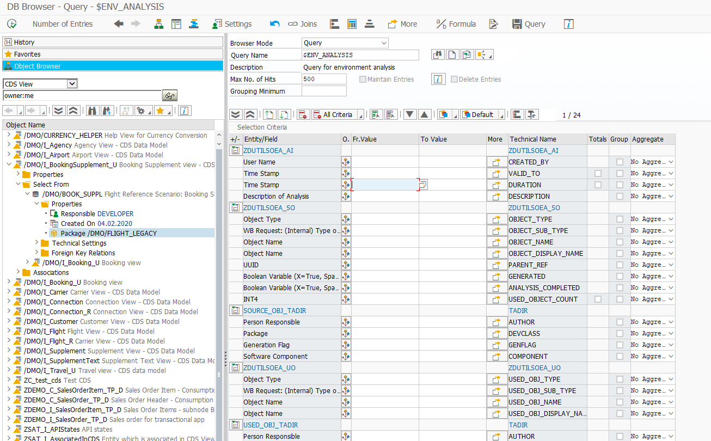

# abap-db-browser

## Documentation

See [here](https://devepos.com/projects/sap-gui/db-browser/)

## Important Information

### Dependencies

- [abap-search-tools](https://github.com/DevEpos/abap-search-tools)
- [abap-ui-toolbox](https://github.com/DevEpos/abap-ui-toolbox)

### Installation Guide
Install this repository using [abapGit](https://github.com/abapGit/abapGit#).  
See the [Installation Guide](https://devepos.com/projects/abap-db-browser/installation.html)

#### SAP NetWeaver Compatibility
Due to some used classes which are only available starting from **v7.50** a downwards compatibility to **v7.40** in a single 
branch is currently not possible, without resorting to some dynamic programming.
